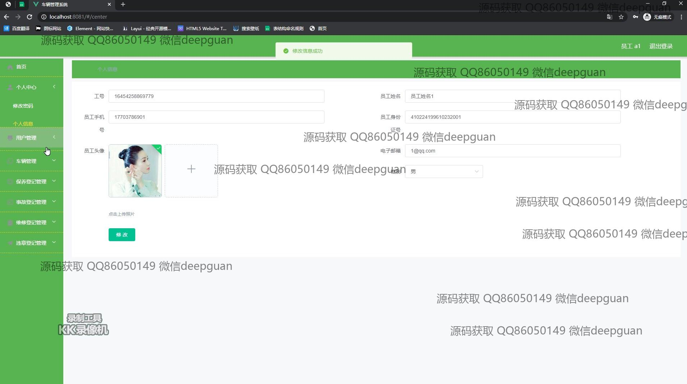

<h1 align="center">车辆管理系统</h1>

## 简介
车辆管理系统：角色分为管理员、用户；功能包括车辆信息管理、用户信息管理、违规登记、事故记录、车辆类型管理，提供违章、事故等数据的查询和编辑，确保系统化、高效的车辆管理和信息维护。    --计算机毕业设计源码；毕设源码；java毕业设计源码

## 联系方式

<h3 align="center">获取完整代码与数据库文件 + 微信：deepguan QQ: 86050149 QQ群: 783742310</h3>

<h3 align="center">可帮忙远程部署 包运行成功！提供远程部署、修改代码、设计文档指导、代码讲解等服务！</h3>

## 功能介绍（完整见运行截图）
管理员：登录界面允许管理员身份验证，通过侧边栏访问个人中心、用户管理、车辆管理、违规登记管理等功能。管理员可以在车辆管理模块中添加、修改、删除车辆信息，并记录或编辑车辆的违规信息细节。用户管理页面提供对用户基本信息的编辑和查询操作，包括用户名、手机号、身份证号、电子邮箱等字段。违规登记管理模块支持查询、查看、修改和删除违规记录，并通过搜索功能筛选用户、手机号、车牌类型等信息。事故登记页面允许录入详细的事故情况，提升操作体验。  
用户：登录后通过侧边栏进入个人中心界面，在用户信息页可查看和编辑个人身份证号、手机号、电子邮箱等信息，还提供头像上传功能。在车辆管理模块，用户可按车辆名称、车牌号查询车辆信息，并进行添加和编辑操作。个人中心模块支持用户姓名、身份证号、性别等信息的编辑，同时可以查看驾驶证与准驾车型信息。在事故登记和管理页面，用户能查看事故编号、名称及详细描述，并使用日期选择器记录事故时间。

## 运行截图

本代码来源于网络,仅供学习参考使用!

